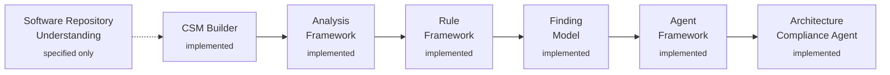

# Architecture Intelligence Platform (AIP)

AIP is an AI-assisted software engineering platform that continuously
analyzes software systems to identify architectural, design, security,
technical, operational, and compliance risks. It is intended to act as
a continuous architecture governance capability throughout the
software development lifecycle, not a one-time architecture review
tool.

See [`openspec/project.md`](openspec/project.md) for the full project
vision, core principles, functional scope, and technology direction.
See [`docs/architecture.md`](docs/architecture.md) for architecture
and pipeline diagrams (capability chain, module graph, the
validate-before-publish gate, an end-to-end worked example), and
[`docs/design.md`](docs/design.md) for the technical design underneath
them (identity schemes, the shared Scope/applicability model, the
AI-isolation boundary, accepted v1 limitations).

## Status

Every capability in `openspec/project.md` §11's evolution order is
specified, implemented, tested, and archived:



`mvn verify` from the repository root builds and architecturally
guards the full six-module reactor: **384 tests, 0 failures**, plus
every module's own dependency-graph, fixture-scope, and
no-AI-import CI guards. Analysis Framework has been through the
Explore → Archive cycle twice — its original specification, and a
`2026-09-18` amendment adding Incremental Analysis support and
strengthening the Analysis Result validation/publish gate (see
`openspec/changes/archive/`).

| Module | Capability | Depends on |
|---|---|---|
| `aip-core` | CSM domain model, Repository Evidence contract, four read-only `*Source` contracts | — |
| `aip-csm-builder` | Repository Evidence → CSM Snapshot construction | `aip-core` |
| `aip-analysis` | Analyzer contract + orchestration → `AnalysisResult` | `aip-core` |
| `aip-rules` | Rule Type contract + orchestration → `RuleEvaluationResult`, plus the first concrete Rule Type (boundary compliance) | `aip-core` |
| `aip-findings` | `RuleEvaluationResult` → `Finding` construction | `aip-core` |
| `aip-ai` | Agent contract + orchestration → `Recommendation`, plus the first concrete Agent (Architecture Compliance) — the only AI-bearing module | `aip-core` |

All six modules are independent siblings of `aip-core` — none depends
on any other, even though the content they produce flows through all
of them in sequence at runtime; each layer reads its upstream
neighbor's output only through a dedicated `aip-core` contract. See
[`docs/architecture.md`](docs/architecture.md) §2 for the full
dependency graph and the CI checks enforcing it.

`aip-analyzer` (a real Repository Understanding implementation) and
`aip-cli`/`aip-server` are named in `openspec/project.md`'s module
chain but not yet built. Every module boundary above has so far been
exercised only against hand-built test fixtures — no real
`aip-csm-builder` → `aip-analysis` adapter and no concrete `Analyzer`
exist yet either.

### In progress

`openspec/changes/explore-next-evolution/` inventories the gap above
and recommends closing it before adding further capabilities.
`openspec/changes/define-declared-knowledge-construction/` is the
first step (a new module constructing `declared` Architecture
Component/Boundary content — currently required by the one built
Agent but constructible nowhere in this codebase today); its
Specify-phase artifacts exist but its first Review pass returned
**REVISE**, and no implementation code exists yet.

## Development Methodology

AIP follows Spec-Driven Development using [OpenSpec](https://github.com/Fission-AI/OpenSpec).
Specifications under `openspec/specs/` are the source of truth for
system behavior and architectural decisions. See
[`CLAUDE.md`](CLAUDE.md) for the mandatory development workflow:

```
Explore → Propose → Design → Specify → Review → Implement → Test → Verify → Archive
```

Implementation is not started until a change's specification and
design have been reviewed and approved.

## Repository Layout

```
pom.xml                  # Maven parent aggregator (Java 21+)
aip-core/                 # CSM domain model (aip.core.csm), Repository
│                          # Evidence contract (aip.core.evidence),
│                          # four read-only Source contracts
aip-csm-builder/           # Repository Evidence → CSM Snapshot
aip-analysis/              # Analyzer contract + orchestration → AnalysisResult
aip-rules/                 # Rule Type contract + orchestration → RuleEvaluationResult
│                          # + aip.rules.boundarycompliance (concrete Rule Type)
aip-findings/               # RuleEvaluationResult → Finding
aip-ai/                    # Agent contract + orchestration → Recommendation
│                          # + aip.ai.architecturecompliance (concrete Agent)
│                          # the only AI-bearing module
scripts/                 # Architectural guard scripts bound to `mvn verify`
docs/
├── architecture.md       # Pipeline, module graph, and sequence diagrams
└── design.md             # Identity schemes, Scope model, extension
                           # pattern, AI-isolation boundary

openspec/
├── project.md          # Project vision, principles, and scope
├── config.yaml          # OpenSpec project configuration
├── specs/                # Approved, current specifications (source of truth)
│   ├── software-repository-understanding/
│   ├── canonical-software-model/
│   ├── csm-builder/
│   ├── analysis-framework/
│   ├── rule-framework/
│   ├── finding-model/
│   ├── agent-framework/
│   └── architecture-compliance-agent/
└── changes/
    └── archive/           # Every completed define-*/implement-* cycle:
                            # proposal, design, tasks, traceability
```

## Building and Testing

```
mvn verify
```

Runs the full reactor build, test suite, and every module's own
architectural guard scripts. See
[`docs/architecture.md`](docs/architecture.md) §9 for the complete
guard-script table.

## Contributing

Every significant feature or architectural change follows the mandatory
workflow above. Read `openspec/project.md`, the relevant specs under
`openspec/specs/`, and any active change under `openspec/changes/`
before proposing or implementing changes.
