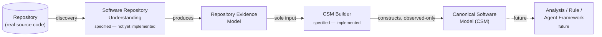
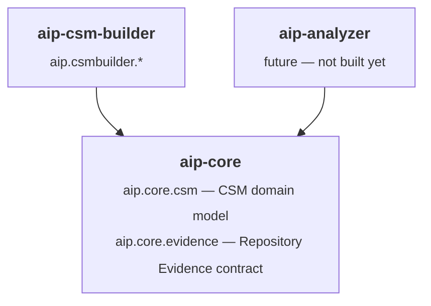
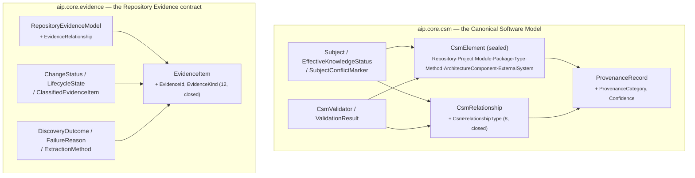
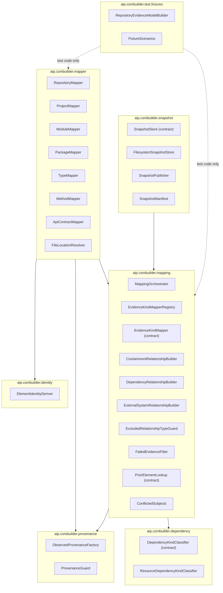
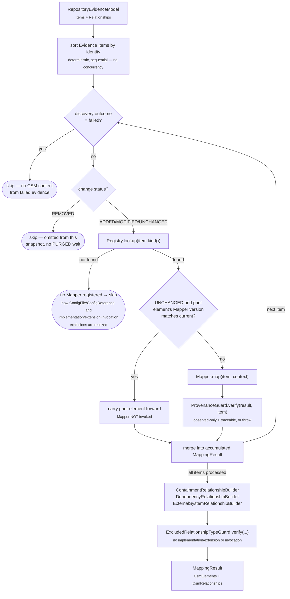
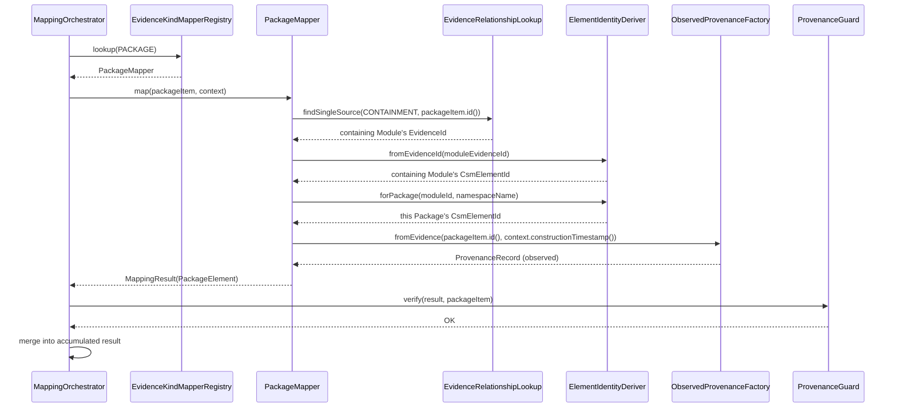
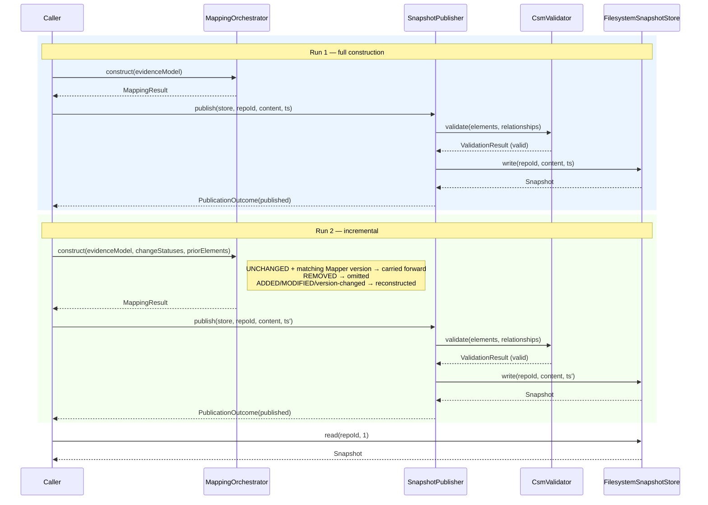
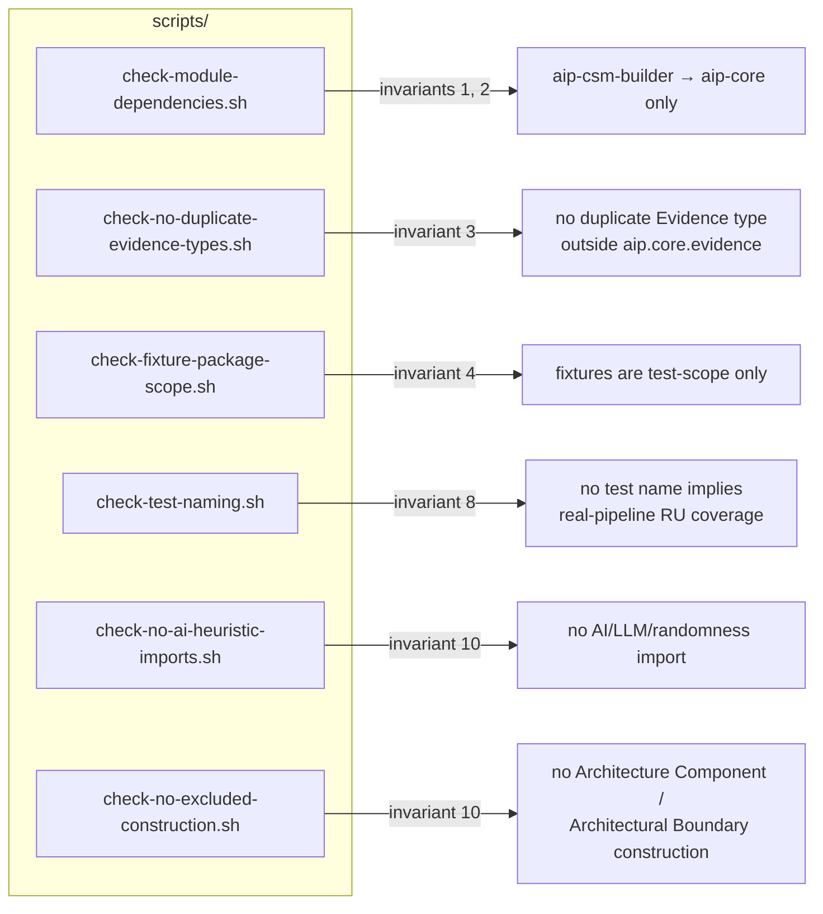
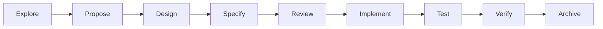

# AIP Architecture and Design Flow

This document diagrams the architecture actually implemented —
grounded in the archived specifications under `openspec/specs/` and
the code under `aip-core`/`aip-csm-builder`. CSM Builder's
implementation is complete (all 92 tasks); see
[`openspec/changes/archive/2026-08-11-implement-csm-builder/tasks.md`](../openspec/changes/archive/2026-08-11-implement-csm-builder/tasks.md)
for the full task-by-task record,
[`.../traceability.md`](../openspec/changes/archive/2026-08-11-implement-csm-builder/traceability.md)
for the requirement/scenario-to-test matrix, and
[`.../invariants.md`](../openspec/changes/archive/2026-08-11-implement-csm-builder/invariants.md)
for the architectural invariants this document's guard diagram (§8)
reflects.

## 1. Capability chain

The platform's evolution order, per `openspec/project.md` §11. Each
box is independently specified and archived under `openspec/specs/`.

CSM Builder's implementation proceeded independently of a Repository
Understanding implementation — it depends only on the **Repository
Evidence contract** (a data shape, `aip.core.evidence`), never on a
concrete RU implementation module. Every test exercising CSM Builder
does so against hand-built, contract-faithful fixtures
(`aip.csmbuilder.test.fixtures`, test-scope only), never a real RU
pipeline — the real pipeline's integration test is a reserved,
not-yet-written seam:
[`RepositoryToCsmPipelineIntegrationTest`](../aip-csm-builder/src/test/java/aip/csmbuilder/integration/RepositoryToCsmPipelineIntegrationTest.java).
See
[`.../explore.md`](../openspec/changes/archive/2026-08-11-implement-csm-builder/explore.md)
for the full sequencing rationale.

## 2. Module dependency graph

**Invariant, enforced by `scripts/check-module-dependencies.sh` bound
to `aip-csm-builder`'s `verify` phase:** `aip-csm-builder` depends on
`aip-core` only — never on `aip-analyzer` or any future Repository
Understanding implementation module. `aip-analyzer` and
`aip-csm-builder` are siblings: both depend on `aip-core`, neither
depends on the other. See
[`design.md`](../openspec/changes/archive/2026-08-11-implement-csm-builder/design.md)
Decision 1.

## 3. `aip-core`: two independent domain models

`csm` and `evidence` are deliberately independent — neither package
imports the other. This is what lets a CSM element's provenance
reference an Evidence identity by opaque string (`ProvenanceRecord.sourceReference()`)
without a compile-time coupling between the two contracts (see
`aip.core.evidence`'s own package-info for the full rationale).
`Subject`/`SubjectConflictMarker`/`CsmValidator` were added mid-implementation
(Section 18/19) to close two real gaps found while implementing CSM
Builder — see `design.md` Decisions 10 and 11.

## 4. `aip-csm-builder`: package structure

Every solid arrow is a real, compile-scope package dependency; dashed
arrows are test-scope only. Two directional invariants worth noting,
both mechanically enforced (§7):

- **`mapping` never depends on `snapshot`.** Incremental re-derivation
  (`PriorElementLookup`) is `mapping`'s own minimal interface —
  `EvidenceId -> Optional<CsmElement + mapperVersion>` — not a
  dependency on `Snapshot`/`SnapshotManifest`. `snapshot` depends on
  `mapping` (to persist what it constructs), never the reverse. See
  `design.md` Decision 9.
- **Nothing in `aip.csmbuilder.mapper`/`mapping` depends on
  `aip.csmbuilder.test.fixtures`.** The fixture-building API exists
  only in test sources; production construction logic depends only on
  `aip.core.evidence` *types*, never on how an instance of them was
  produced (`scripts/check-fixture-package-scope.sh`).

## 5. Evidence → CSM construction pipeline (one run)

The full `MappingOrchestrator.construct` flow, including incremental
scoping (Sections 16–17) and the batch relationship builders that run
after every Evidence Item has been dispatched (Sections 8, 10–11).

## 6. A single item's processing, in detail

Illustrated for `PackageMapper`, the one Mapper whose identity
derivation depends on another Evidence Item (its containing Module) —
see `PackageMapper`'s and `EvidenceRelationshipLookup`'s own class
javadoc for why this lookup is order-independent (it re-derives the
Module's identity via the same pure function every other Mapper uses,
rather than asking the Orchestrator whether the Module has already
been processed).

Note that `PackageMapper` never asks the Orchestrator "has the Module
already been mapped?" — it independently re-derives the Module's CSM
identity via the same pure `ElementIdentityDeriver` function every
other Mapper uses. This is what makes the result identical regardless
of dispatch order (proven by `PackageMapperTest.packageIdentityIsIndependentOfDispatchOrderRelativeToItsModule`).

## 7. Snapshot lifecycle across two runs

How construction, validation, persistence, and incremental
re-derivation compose — the scenario
`CsmBuilderFixtureEndToEndTest` exercises directly (Sections 15–19).

A snapshot that fails `CsmValidator` is never written at all — `SnapshotPublisher`
gates `SnapshotStore.write`, so an invalid snapshot and a written one
are mutually exclusive outcomes (`SnapshotPublisher.PublicationOutcome`'s
own invariant).

## 8. Architectural guards enforced at `mvn verify`

Six build-time checks, independent of the test suite, per
[`invariants.md`](../openspec/changes/archive/2026-08-11-implement-csm-builder/invariants.md).
All run in the `verify` phase; five are `aip-csm-builder`-scoped, one
(evidence-type uniqueness) is reactor-wide.

## 9. Development workflow

Every significant capability or implementation change follows this
sequence (`CLAUDE.md`) — CSM Builder is the first capability to have
completed the full cycle, archived under
[`openspec/changes/archive/2026-08-11-implement-csm-builder/`](../openspec/changes/archive/2026-08-11-implement-csm-builder/).

`openspec/specs/` holds the source-of-truth output of Specify/Review
for each capability; `openspec/changes/archive/` preserves every
completed cycle's Explore/Proposal/Design/Tasks artifacts for
traceability.
