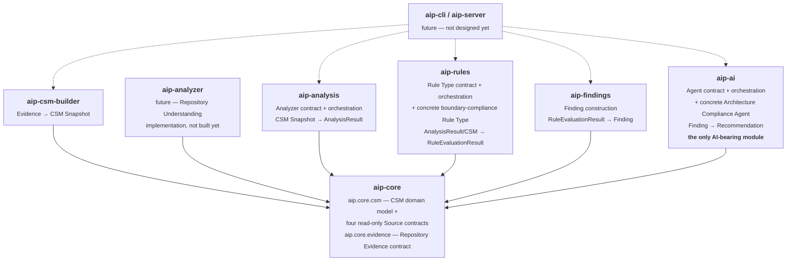
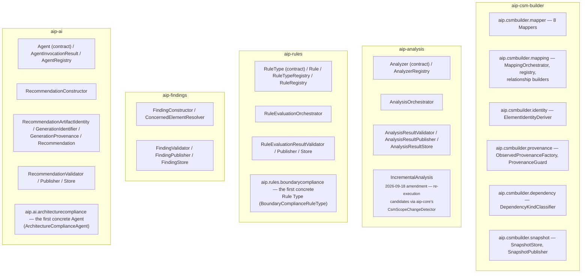
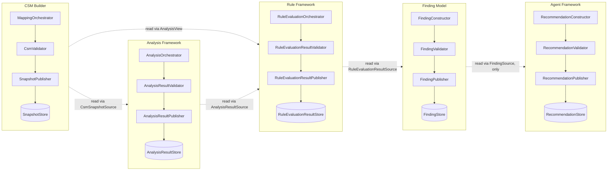
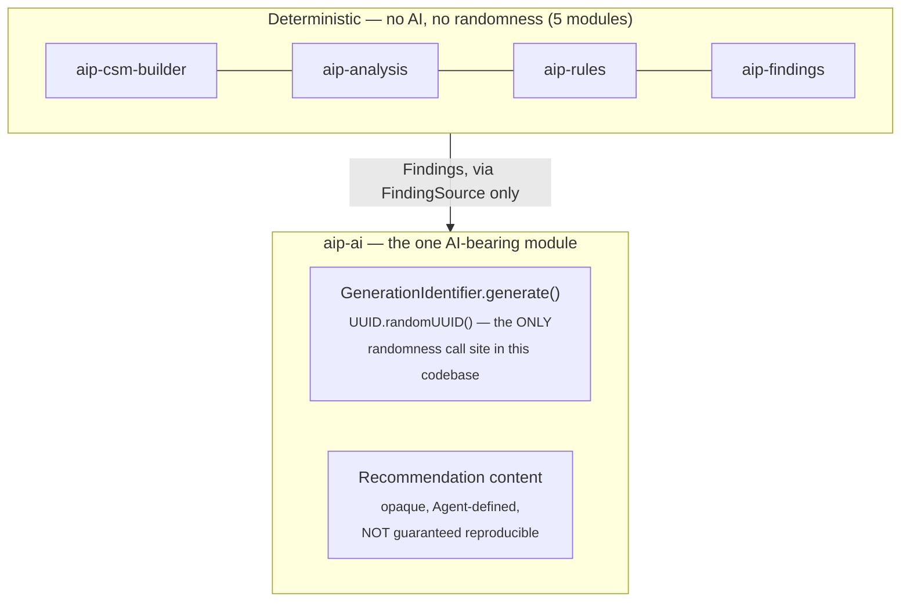
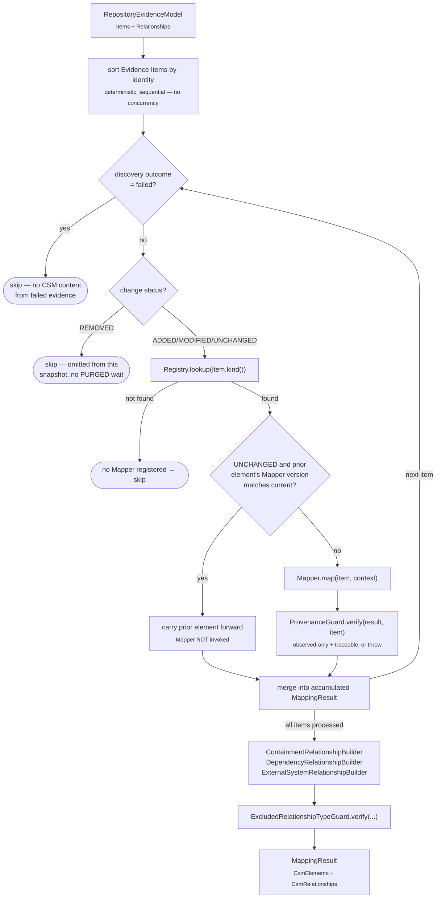
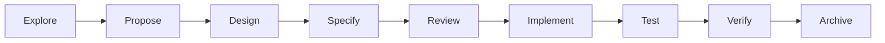

# AIP Architecture and Design Flow

This document diagrams the architecture actually implemented — every
capability named in `openspec/project.md` §11's evolution order is
specified (`openspec/specs/`), implemented, tested, and archived
(`openspec/changes/archive/`). The system is a six-module Maven
reactor, `mvn verify` from the repository root builds and
architecturally guards all of it: 384 tests, 0 failures, across
`aip-core`, `aip-csm-builder`, `aip-analysis`, `aip-rules`,
`aip-findings`, and `aip-ai`.

A capability's cycle can repeat: Analysis Framework's own
`analysis-framework` spec has been through Explore → Archive twice —
its original `2026-08-13` pair, and a `2026-09-18` amendment pair
adding Incremental Analysis support (`CsmScopeChangeDetector`,
`aip-core`) and strengthening the Analysis Result validation/publish
gate to explicitly cover the `AnalysisResultStore` itself, not only
"published as usable output."

For the detailed technical design underlying this diagram set — identity
schemes, the validate-before-publish gate repeated at every layer,
extension mechanisms, and the AI-isolation boundary — see
[`docs/design.md`](design.md).

## 1. Capability chain

The platform's full evolution order, per `openspec/project.md` §11.
Every box is specified under `openspec/specs/` and, except Software
Repository Understanding, implemented and tested.

```mermaid
flowchart LR
    Repo[("Repository<br/>(real source code)")]
    RU["Software Repository<br/>Understanding<br/><sub>specified — not yet implemented</sub>"]
    RE["Repository Evidence<br/>Model"]
    CB["CSM Builder<br/><sub>implemented</sub>"]
    CSM["Canonical Software<br/>Model (CSM) Snapshot"]
    AF["Analysis Framework<br/><sub>implemented</sub>"]
    AR["Analysis Results"]
    RF["Rule Framework<br/><sub>implemented</sub>"]
    REv["Rule Evaluation<br/>Results"]
    FM["Finding Model<br/><sub>implemented</sub>"]
    Find["Findings"]
    AgF["Agent Framework<br/><sub>implemented</sub>"]
    Rec["Recommendations"]
    ACA["Architecture Compliance<br/>Agent<br/><sub>implemented — first concrete<br/>Rule Type + Agent</sub>"]

    Repo -->|discovery| RU
    RU -->|produces| RE
    RE -->|sole input| CB
    CB -->|constructs, observed-only| CSM
    CSM -->|sole input| AF
    AF -->|produces| AR
    CSM -->|Analysis View| RF
    AR -->|via AnalysisResultSource| RF
    RF -->|produces| REv
    REv -->|via RuleEvaluationResultSource| FM
    FM -->|produces| Find
    Find -->|via FindingSource, only| AgF
    AgF -->|produces| Rec
    ACA -.->|registers boundary-compliance<br/>Rule Type + Agent, no new mechanism| RF
    ACA -.->|registers| AgF
```



CSM Builder's implementation proceeded independently of a Repository
Understanding implementation — it depends only on the **Repository
Evidence contract** (a data shape, `aip.core.evidence`), never on a
concrete RU implementation module. Every layer above it follows the
same discipline: each depends on `aip-core`'s own contracts, never on
the module that produced the content flowing through them. See
[`.../implement-csm-builder/explore.md`](../openspec/changes/archive/2026-08-11-implement-csm-builder/explore.md)
for the original sequencing rationale, which every later `implement-*`
change reused unchanged.

## 2. Module dependency graph



**Invariant, mechanically enforced by `scripts/check-module-dependencies.sh`
bound to every module's own `verify` phase:** every module below
`aip-core` depends on `aip-core` **only**. `aip-csm-builder`,
`aip-analyzer`, `aip-analysis`, `aip-rules`, `aip-findings`, and
`aip-ai` are six independent siblings — **none depends on any other**,
even though the *content* they produce flows through all of them in
sequence at runtime. Each layer's own read access to its upstream
neighbor's output goes through a dedicated `aip-core` contract instead
(§3), never a direct module dependency — reused,
`check-no-module-reference.sh`-enforced pattern from
`implement-rule-framework` onward:

| Module | Forbidden cross-references (CI-enforced) |
|---|---|
| `aip-rules` | `aip.analysis.` |
| `aip-findings` | `aip.rules.`, `aip.analysis.`, `aip.csmbuilder.` |
| `aip-ai` | `aip.findings.`, `aip.rules.`, `aip.analysis.`, `aip.csmbuilder.` |

`aip-ai` is additionally the **only** module exempt from
`check-no-ai-heuristic-imports.sh` — see §6.

## 3. `aip-core`: the domain model and its four read contracts

`aip-core` grew one layer at a time, once per `implement-*` change,
always for the same reason: a general artifact type or read contract
with an already-named future consumer gets promoted here rather than
duplicated per-module. 45 types now live in `aip.core.csm`, plus the
independent `aip.core.evidence` Repository Evidence contract.

```mermaid
graph TD
    subgraph csm["aip.core.csm"]
        subgraph domain["CSM domain model (implement-csm-builder)"]
            Elem["CsmElement (sealed)<br/><sub>Repository·Project·Module·Package·Type·<br/>Method·ArchitectureComponent·ExternalSystem</sub>"]
            Rel["CsmRelationship<br/><sub>+ CsmRelationshipType (8, closed)</sub>"]
            Prov["ProvenanceRecord<br/><sub>+ ProvenanceCategory, Confidence</sub>"]
            Subj["Subject / EffectiveKnowledgeStatus<br/>/ SubjectConflictMarker"]
            Snap["CsmSnapshotSource / CsmSnapshotId"]
            Valid["CsmValidator / ValidationResult"]
        end
        subgraph analysisLayer["Analysis Framework (implement-analysis-framework)"]
            View["AnalysisView<br/><sub>effective-knowledge projection</sub>"]
            Scope["CsmScope / CsmScopeInstance /<br/>CsmScopeEvaluator<br/><sub>shared Scope declaration, reused<br/>verbatim by every later layer</sub>"]
            AR["AnalysisResult / AnalysisResultId"]
            Change["CsmScopeChangeDetector<br/><sub>2026-09-18 amendment — coarse<br/>scope-content diff across two<br/>AnalysisViews, for Incremental<br/>Analysis's re-execution-candidate<br/>determination</sub>"]
        end
        subgraph ruleLayer["Rule Framework (implement-rule-framework)"]
            ARS["AnalysisResultSource"]
            RER["RuleEvaluationResult /<br/>RuleEvaluationResultId /<br/>RuleEvaluationOutcome"]
        end
        subgraph findingLayer["Finding Model (implement-finding-model)"]
            RERS["RuleEvaluationResultSource"]
            FM["FindingMetadata<br/><sub>Rule-Type-declared Category/<br/>Severity/Description/Impact contract</sub>"]
            F["Finding / EvaluationIdentity /<br/>LogicalFindingIdentity"]
        end
        subgraph agentLayer["Agent Framework (implement-agent-framework)"]
            FS["FindingSource"]
        end
    end
    subgraph evidence["aip.core.evidence"]
        EI["EvidenceItem<br/><sub>+ EvidenceId, EvidenceKind (12, closed)</sub>"]
        REM["RepositoryEvidenceModel<br/><sub>+ EvidenceRelationship</sub>"]
    end

    domain --> analysisLayer --> ruleLayer --> findingLayer --> agentLayer
```



Four read-only `*Source` contracts — `CsmSnapshotSource`,
`AnalysisResultSource`, `RuleEvaluationResultSource`, `FindingSource` —
share one shape: read-by-identity, list-by-producer-and-scope, and
nothing else. Each was placed in `aip-core` (rather than the producing
module) specifically because a **second, already-named future
consumer** existed at design time (e.g. `AnalysisResultSource` was
named as Rule Framework's own future need while still specifying
Analysis Framework). `RecommendationStore` (`aip-ai`) is the one
deliberate exception — no second consumer of Recommendations is named
anywhere in `project.md` yet, so it stays module-local (see
[`design.md`](design.md) §4).

`aip.core.csm` and `aip.core.evidence` remain deliberately independent
packages — neither imports the other, enforced by
`check-no-duplicate-csm-types.sh` / `check-no-duplicate-evidence-types.sh`.

## 4. Six-module package structure



Every module (except `aip-core` itself) follows the same internal
shape: a **contract** (`Analyzer`/`RuleType`/`Agent`), a **registry**,
an **orchestrator** (except `aip-findings` and, deliberately,
`aip-ai` — see §7), and a **validate-then-publish gate**
(`*Validator`/`*Publisher`/`*Store`). `aip-rules` and `aip-ai` each
additionally host one concrete worked example — the boundary-compliance
Rule Type and the Architecture Compliance Agent — in their own
subpackage, never the module's flat top-level package, per
`implement-architecture-compliance-agent/design.md` Decision 1.

## 5. The validate-before-publish gate, repeated at every layer

The single most-repeated structural pattern in this codebase — every
producing layer constructs its own artifact type, validates it before
it becomes usable output, and trusts (never re-verifies) the layer
immediately below it.



An invalid artifact and a written one are always mutually exclusive at
every layer (each layer's own `PublicationOutcome`-shaped record
enforces this at construction time, not just by convention) — Analysis
Framework's own gate was strengthened in a `2026-09-18` amendment to
state this explicitly at the store level ("no Analysis Result that
failed validation SHALL ever be present in the `AnalysisResultStore`"),
closing a wording gap the rest of this table's layers did not have.
Each validator checks referential integrity against its **immediate**
upstream layer only — it never re-verifies the layer two steps
removed, since that layer's own gate already did. `RecommendationValidator`
is the one layer whose checks are explicitly *structural and
referential only* — it cannot, and does not claim to, verify that a
Recommendation's guidance is substantively good (see
[`design.md`](design.md) §5).

## 6. Non-determinism boundary: `aip-ai` alone



`check-no-ai-heuristic-imports.sh` runs against all five deterministic
modules, forbidding `java.util.Random`/`SecureRandom`/
`ThreadLocalRandom` and known AI/LLM SDK package imports. It is
**deliberately not wired for `aip-ai`** — `GenerationIdentifier`'s
per-invocation token is the one legitimate, narrowly-scoped exception,
documented in `aip-ai`'s own `package-info.java`. The framework
guarantees deterministic **Recommendation Artifact Identity** (stable,
collision-free, durably retrievable) while making no claim that
regenerating from the same `(Agent, version, Finding)` produces
similar content — see [`design.md`](design.md) §6 for the full
determinism-guarantee/non-guarantee split.

`ArchitectureComplianceAgent`, the one concrete Agent implemented so
far, is itself a **deterministic, template-based** realization — it
never calls an external model (`implement-architecture-compliance-agent/design.md`
Decision 6). No concrete LLM/model-provider adapter exists anywhere in
this codebase yet.

## 7. End-to-end worked example: a boundary violation, start to finish

The one concrete vertical slice implemented across every layer —
`BoundaryComplianceRuleType` (`aip-rules`) through
`ArchitectureComplianceAgent` (`aip-ai`). No cross-module test spans
this whole path (siblings cannot depend on each other), so it is
demonstrated as two fixture-bridged test suites at the Finding
boundary; this diagram shows the full logical flow they together cover.

```mermaid
sequenceDiagram
    participant CSM as CSM Snapshot
    participant RO as RuleEvaluationOrchestrator
    participant RT as BoundaryComplianceRuleType
    participant RV as RuleEvaluationResultValidator
    participant FC as FindingConstructor
    participant FV as FindingValidator
    participant RC as RecommendationConstructor
    participant AG as ArchitectureComplianceAgent
    participant RecV as RecommendationValidator

    CSM->>RO: AnalysisView (dependency + boundary/constraint relationships)
    RO->>RT: evaluate(rule, view, scopeInstance)
    Note right of RT: for each "must not depend on" constraint<br/>sourced at this Architecture Component,<br/>does an observed dependency violate it?
    RT-->>RO: RuleTypeEvaluation(FAIL, BoundaryComplianceDiagnostic)
    RO->>RO: wrap into RuleEvaluationResult
    RO->>RV: validate(result, view, ...)
    RV-->>RO: valid
    RO-->>CSM: RuleEvaluationResult published (FAIL)

    FC->>FC: qualifies? outcome==FAIL &&<br/>payload instanceof FindingMetadata
    FC->>FC: construct Finding<br/>(Description/Impact carry violation detail)
    FC->>FV: validate(finding, ruleEvaluationResultSource)
    FV-->>FC: valid
    FC-->>FC: Finding published

    RC->>RC: GenerationIdentifier.generate()
    RC->>AG: invoke(finding)
    Note right of AG: deterministic, template-based —<br/>no model call; reads Finding.description()<br/>for violation identification
    AG-->>RC: AgentInvocationResult(content, confidence, provenance)
    RC->>RC: wrap into Recommendation
    RC->>RecV: validate(recommendation, findingSource, agentRegistry)
    RecV-->>RC: valid
    RC-->>RC: Recommendation published
```

The Architecture Compliance Agent never reads the underlying
`RuleEvaluationResult` or CSM content directly — the violating
dependency target and violated boundary relationship identities reach
it entirely through `Finding.description()`, computed dynamically
per-instance by the Rule Type and carried through Finding Model's
existing, unmodified field-copy mechanism (see
[`design.md`](design.md) §3).

## 8. CSM Builder deep dive: Evidence → CSM construction pipeline

The one layer with genuinely rich internal structure — incremental
re-derivation, Mapper versioning, and batch relationship building. The
full `MappingOrchestrator.construct` flow:



See [`.../implement-csm-builder/design.md`](../openspec/changes/archive/2026-08-11-implement-csm-builder/design.md)
for the full rationale, and
[`.../invariants.md`](../openspec/changes/archive/2026-08-11-implement-csm-builder/invariants.md)
for the architectural invariants §9's guard table reflects.

## 9. Architectural guards enforced at `mvn verify`

Every module's own `verify` phase runs its architectural guard scripts
independently of the test suite. `mvn verify` from the repository root
runs all of them across all six modules.

| Script | Scope | Enforces |
|---|---|---|
| `check-module-dependencies.sh` | every module | depends on `aip-core` only (or `aip-core`'s own zero-dependency rule) |
| `check-no-module-reference.sh` | `aip-rules`, `aip-findings`, `aip-ai` | no cross-reference to a sibling module's package (see §2 table) |
| `check-fixture-package-scope.sh` | every module with a fixture layer | production source never imports the test-only `*.test.fixtures` package |
| `check-no-ai-heuristic-imports.sh` | all **except** `aip-ai` | no randomness or AI/LLM SDK import |
| `check-no-concurrency-infrastructure.sh` | `aip-analysis` | no concurrency primitives — sequential dispatch behind a concurrency-permitting contract |
| `check-no-duplicate-csm-types.sh` | reactor-wide | no CSM/Analysis contract type declared outside `aip.core.csm` |
| `check-no-duplicate-evidence-types.sh` | reactor-wide | no Repository Evidence contract type declared outside `aip.core.evidence` |
| `check-no-csm-builder-analysis-adapter.sh` | reactor-wide | no real `aip-csm-builder`→`aip-analysis` adapter exists yet |
| `check-test-naming.sh` | `aip-csm-builder` | no test name implies real-pipeline Repository Understanding coverage |
| `check-no-excluded-construction.sh` | `aip-csm-builder` | never constructs an Architecture Component or Architectural Boundary (CSM Builder is observed-only) |

## 10. Development workflow

Every significant capability or implementation change follows this
sequence (`CLAUDE.md`). All eight `project.md` §11 capabilities have
now completed the full cycle at least once (`define-*` for
specification, `implement-*` for code); each is archived under
[`openspec/changes/archive/`](../openspec/changes/archive/).



`openspec/specs/` holds the source-of-truth output of Specify/Review
for every capability — `canonical-software-model`, `software-repository-understanding`,
`csm-builder`, `analysis-framework`, `rule-framework`, `finding-model`,
`agent-framework`, `architecture-compliance-agent`.
`openspec/changes/archive/` preserves every completed cycle's
Explore/Proposal/Design/Tasks/Traceability artifacts for traceability —
16 archived changes as of this writing: one `define-*`/`implement-*`
pair for each of Analysis Framework, Rule Framework, Finding Model,
Agent Framework, and Architecture Compliance Agent, plus CSM Builder's
own `define-*`/`implement-*` pair, `define-canonical-software-model`,
`define-software-repository-understanding` (not yet implemented), and
a second `define-*`/`implement-*` pair (`2026-09-18`) amending Analysis
Framework with Incremental Analysis support and a strengthened
validation gate.

`openspec/changes/explore-next-evolution/` and
`openspec/changes/define-declared-knowledge-construction/` are active,
unarchived changes as of this writing — see `CLAUDE.md`'s "Current
Development Focus" for their status. `declared-knowledge-construction`
Propose/Design/Specify are complete but its first Review pass returned
REVISE; no `aip-declared-knowledge` module or code exists yet.
