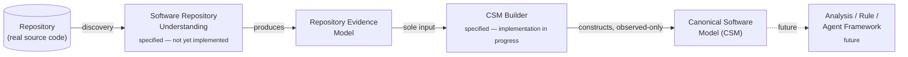
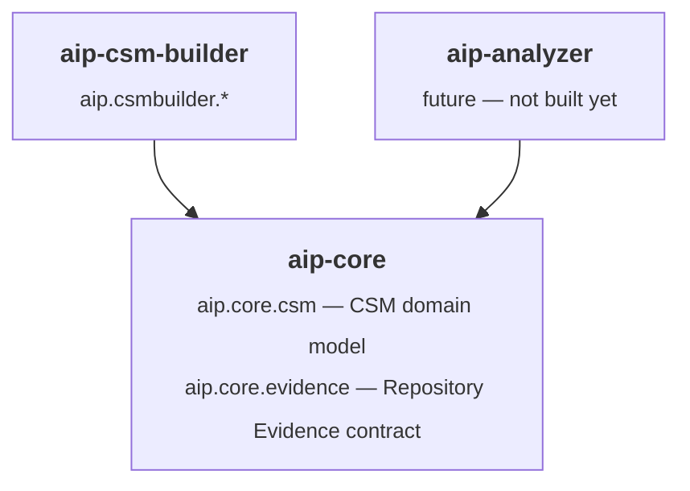
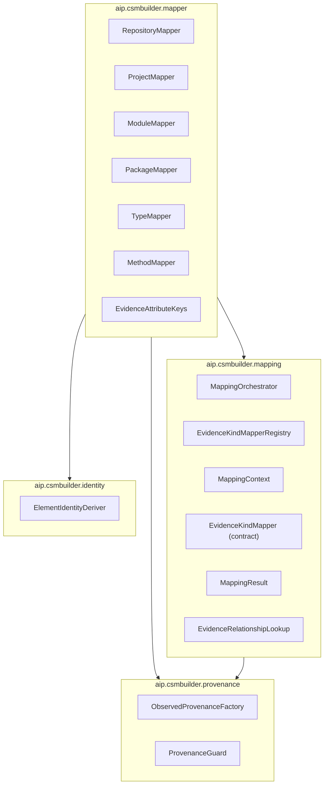
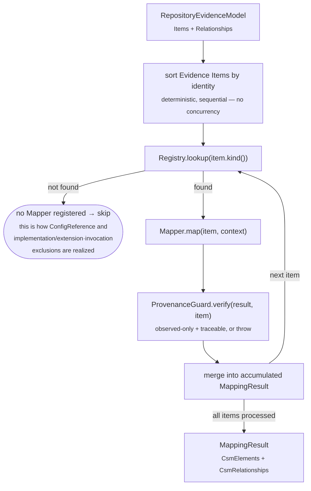
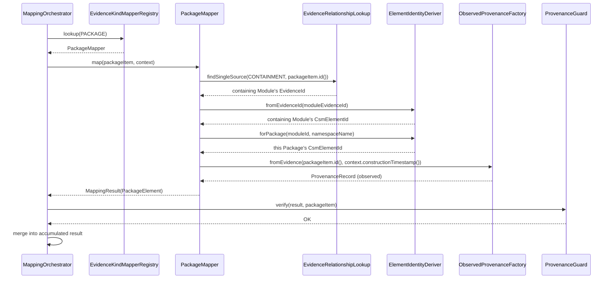
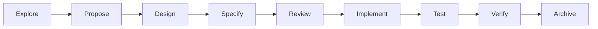

# AIP Architecture and Design Flow

This document diagrams the architecture actually implemented so far —
grounded in the archived specifications under `openspec/specs/` and
the code under `aip-core`/`aip-csm-builder`. It is kept in sync as
implementation progresses; see
[`openspec/changes/implement-csm-builder/tasks.md`](../openspec/changes/implement-csm-builder/tasks.md)
for current task-by-task status.

## 1. Capability chain

The platform's evolution order, per `openspec/project.md` §11. Each
box is independently specified and archived under `openspec/specs/`;
only CSM Builder has begun implementation.

CSM Builder's implementation proceeds independently of a Repository
Understanding implementation — it depends only on the **Repository
Evidence contract** (a data shape, `aip.core.evidence`), never on a
concrete RU implementation module. See
[`openspec/changes/implement-csm-builder/explore.md`](../openspec/changes/implement-csm-builder/explore.md)
for the full sequencing rationale.

## 2. Module dependency graph

**Invariant, enforced by `scripts/check-module-dependencies.sh` bound
to `aip-csm-builder`'s `verify` phase:** `aip-csm-builder` depends on
`aip-core` only — never on `aip-analyzer` or any future Repository
Understanding implementation module. `aip-analyzer` and
`aip-csm-builder` are siblings: both depend on `aip-core`, neither
depends on the other. See
[`design.md`](../openspec/changes/implement-csm-builder/design.md)
Decision 1.

## 3. CSM Builder: package structure

Every arrow is a real package dependency in the current codebase.
`aip.csmbuilder.mapper` (the concrete Mapper implementations) is the
only package that depends on all three of the others — `mapping`,
`identity`, and `provenance` remain independently meaningful and
independently testable.

## 4. Orchestration data flow

## 5. A single item's processing, in detail

Illustrated for `PackageMapper`, the one Mapper whose identity
derivation depends on another Evidence Item (its containing Module) —
see [`design.md`](../openspec/changes/implement-csm-builder/design.md)
Decision 3 and Decision 1's task-7 commit message for why this lookup
is order-independent.

Note that `PackageMapper` never asks the Orchestrator "has the Module
already been mapped?" — it independently re-derives the Module's CSM
identity via the same pure `ElementIdentityDeriver` function every
other Mapper uses. This is what makes the result identical regardless
of dispatch order (proven by `PackageMapperTest.packageIdentityIsIndependentOfDispatchOrderRelativeToItsModule`).

## 6. Development workflow

Every significant capability or implementation change follows this
sequence (`CLAUDE.md`):

`openspec/specs/` holds the source-of-truth output of Specify/Review
for each capability; `openspec/changes/archive/` preserves every
completed cycle's Explore/Proposal/Design/Tasks artifacts for
traceability.
