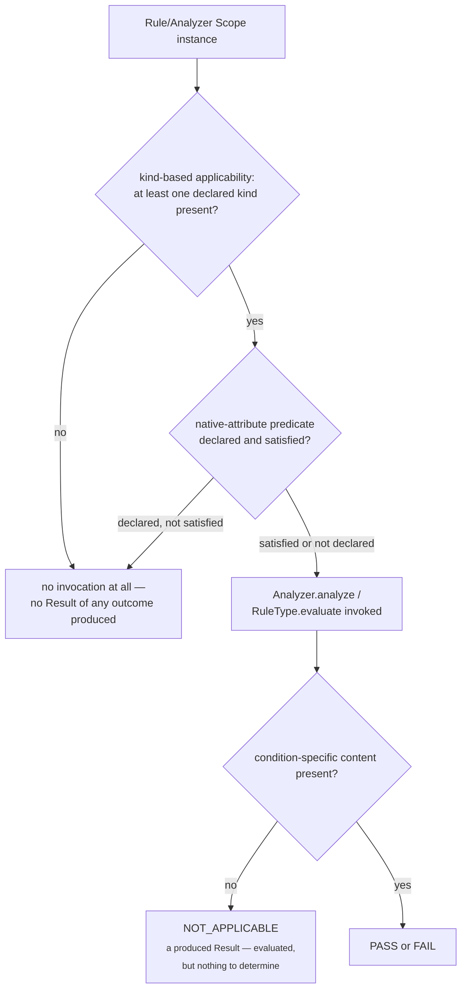
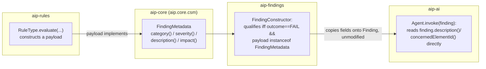

# AIP Technical Design Reference

`docs/architecture.md` diagrams *what* the system is — modules,
pipeline, package structure. This document explains *how* the
recurring mechanisms across every layer actually work: identity
schemes, the shared Scope/applicability model, the extension pattern,
the AI-isolation boundary, and the accepted v1 limitations each
`implement-*` change named explicitly rather than silently absorbed.

Every claim here traces to a specific `design.md` under
`openspec/changes/archive/`; this document consolidates them into one
place rather than requiring a reader to reconstruct the pattern from
five separate archived documents.

## 1. Identity: one pattern, six instances

Every durable artifact in this system has a **deterministic identity**
— a SHA-256 digest (`DeterministicHash`, reimplemented per-module
rather than shared across a module boundary) over an ordered,
`'|'`-joined sequence of its defining components. No artifact's
identity is ever derived from `Object.hashCode()` (unspecified,
non-portable) or from randomness, with exactly one documented
exception (§6).

| Artifact | Identity | Deterministic function of | Set-order independent? |
|---|---|---|---|
| CSM element/relationship | `CsmElementId` | Repository Evidence identity (elements) or source+target+type (relationships) | n/a |
| `AnalysisResult` | `AnalysisResultId` | Analyzer identifier, version, source `CsmSnapshotId`, `CsmScopeInstance` | n/a |
| `RuleEvaluationResult` | `RuleEvaluationResultId` | Rule identifier, version, source `CsmSnapshotId`, `CsmScopeInstance`, **complete consumed `AnalysisResultId` set** | yes — sorted before hashing |
| `Finding` | `EvaluationIdentity` (snapshot-bound) | complete referenced `RuleEvaluationResultId` set | yes |
| `Finding` | `LogicalFindingIdentity` (snapshot-**independent**) | Rule identifier (no version) + concerned CSM element identity | n/a |
| `Recommendation` | `RecommendationArtifactIdentity` | Agent identifier, version, referenced Finding's `EvaluationIdentity`, `GenerationIdentifier` | n/a |

Two design moves recur:

- **A set component is always sorted before hashing.** `Set`'s own
  iteration order is unspecified across JVM runs; `RuleEvaluationResultId`
  and `EvaluationIdentity` each guard against this explicitly, with a
  dedicated test (`consumedSetOrderDoesNotAffectIdentity` and its
  analogues).
- **A payload is never part of identity.** `AnalysisResult.payload()`,
  `RuleEvaluationResult.payload()`, and `Recommendation`'s generated
  content are each excluded from their own artifact's identity
  computation — content-derived identity was considered and rejected
  at every layer that could have used it, for the same reason each
  time: it would make identity unpredictable without already having
  the content, and conflates "same artifact" with "same content,"
  which are different questions once an artifact's content can
  legitimately vary (Recommendation) or is simply irrelevant to
  identity (everything else).

### `Finding`'s two identities: the one genuine departure

Every artifact before `Finding` has exactly one identity, and identical
meaningful inputs always yield the identical artifact — the point
being deduplication. `Finding` is the first artifact needing to answer
a second question no prior layer had: *"is this the same logical issue
as last time, even though the CSM Snapshot changed?"* `EvaluationIdentity`
keeps the established snapshot-bound pattern; `LogicalFindingIdentity`
is additive, deliberately excluding source CSM Snapshot identity and
Rule version, made possible only because CSM element identity is
*already* snapshot-independent by construction (an
`implement-csm-builder`-era fact, load-bearing here). Two Findings
sharing a `LogicalFindingIdentity` but differing `EvaluationIdentity`
represent the same logical issue observed across two evaluation runs —
this is the entire mechanism a future lifecycle/dashboard capability
would need; no mutable state or event log exists anywhere in this
codebase to support it, by design (`implement-finding-model/design.md`
Decision 4).

### `Recommendation`'s identity: the second genuine departure

`RecommendationArtifactIdentity` includes a `GenerationIdentifier` —
an opaque, per-invocation token — precisely because the same `(Agent,
version, Finding)` triple can legitimately produce more than one
independently-valid Recommendation across separate invocations, unlike
every prior layer where identical inputs collapsing to one artifact
was the whole point. "Deterministic identity" here means *reproducible
lookup* (the same recorded components always resolve to the same
artifact), never *reproducible generation* — see §6.

## 2. Scope: one declaration type, reused verbatim, four consumers

`CsmScope` (declared kinds + optional containment anchor + optional
native-attribute predicate) was built once, for Analysis Framework,
and reused **verbatim** — no wrapper type — by Rule Framework's own
Rule Scope. `CsmScopeEvaluator` (enumeration + applicability) was
originally built inside `aip-analysis`, then promoted to `aip-core`
during `implement-rule-framework` when Rule Framework needed the
identical logic and could not depend on `aip-analysis` to get it — a
self-directed refactor, not a planned one, reported transparently at
the time.

Applicability has exactly three possible readings for any scope
instance, and every Analyzer and Rule Type in this codebase implements
all three the same way:

The distinction between "no Result at all" and an explicit
`NOT_APPLICABLE` **Result** is the single most load-bearing binding
sub-decision in `define-rule-framework/design.md` (Decision 5) — a
Rule Scope instance that never satisfies kind-based/native-attribute
applicability is never invoked and produces nothing; one that *is*
invoked but whose condition-specific content is genuinely absent
produces an explicit `NOT_APPLICABLE` Result, never silence. The
boundary-compliance Rule Type's own applicability tests
(`aip-rules/.../BoundaryComplianceRuleTypeTest`) are this pattern's
most concrete, fully-worked demonstration: five distinct fixture
scenarios, one per branch of the flowchart above.

## 3. `FindingMetadata`: the cross-module content-bridging mechanism

Two genuine implementation-level gaps existed once `aip-findings` and
`aip-ai` needed to talk to each other without depending on each other:

1. **How does Finding Model learn a Rule Type's Category/Severity/
   Description/Impact**, given `RuleEvaluationResult.payload()` is
   opaque and Rule-Type-defined?
2. **How does an Agent — whose consumption boundary is Finding-only —
   learn violation details** (e.g. a dependency target, a violated
   boundary relationship) that live one layer further upstream, in the
   `RuleEvaluationResult` it has no access to?

Both are resolved by one mechanism, `FindingMetadata` (`aip.core.csm`,
`implement-finding-model/design.md` Decision 3): a structural
interface a `RuleEvaluationResult`'s payload *may* implement.

Two consequences worth naming explicitly, since neither is obvious
from the type signature alone:

- **Outcome qualification is `FAIL` + `FindingMetadata` conformance,
  jointly.** `PASS` and `NOT_APPLICABLE` never produce a Finding,
  regardless of payload shape; a `FAIL` result whose payload does
  *not* implement `FindingMetadata` also produces no Finding —
  silently, mirroring the kind-based-applicability "no Result, not an
  error" precedent one layer up, not a defect. A Rule Type that never
  intends its failures to become Findings simply omits the interface.
- **`Description`/`Impact` are the one place per-instance dynamic
  content is expected**, not fixed template text — only `Category`/
  `Severity` are required to stay uniform across every instance of one
  Rule Type (checked against the literal requirement text, not
  assumed). `BoundaryComplianceDiagnostic` computes `description()`
  per instance, embedding the violating dependency target's and
  violated boundary relationship's identities as formatted text — this
  is the entire mechanism that lets `ArchitectureComplianceAgent`
  (Finding-only, no `RuleEvaluationResultSource` access) still identify
  the violation precisely in its Recommendation content, with zero new
  `aip-core` contract and no reopening of Agent Framework's own
  Finding-only consumption boundary.

## 4. The extension mechanism: registries, uniform across three layers

`AnalyzerRegistry`, `RuleTypeRegistry`, and `AgentRegistry` are the
same ~40 lines of code, three times: a `TreeMap<String, T>` keyed by
identifier (ordered, for deterministic dispatch), rejecting a second
registration for the same identifier. Registering a new implementation
— an Analyzer, a Rule Type, an Agent — requires **no change** to its
framework's own evaluation, identity, traceability, or validation
mechanism; every `implement-*` change proves this concretely with an
"Extension Mechanism" test registering a second, structurally distinct
example alongside the first.

`implement-architecture-compliance-agent` is this pattern's
end-to-end proof: a concrete Rule Type and a concrete Agent were added
entirely as configuration — new subpackages inside already-existing
modules, zero changes to `RuleEvaluationOrchestrator`, `RuleTypeRegistry`,
`RecommendationConstructor`, `AgentRegistry`, or any `aip-core` type.

## 5. Validation trust boundaries

Every validator in this system checks referential integrity against
its **immediate** upstream artifact only, trusting — never
re-verifying — that upstream artifact's own already-completed
validation. `RuleEvaluationResultValidator` confirms a consumed
`AnalysisResultId` *resolves*; it does not re-check that
`AnalysisResult`'s own CSM-content integrity, which
`AnalysisResultValidator` already established. This is deliberate, not
an oversight: re-verifying the full chain at every layer would make
validation cost grow unboundedly with pipeline depth, for no
correctness benefit beyond what the immediately-prior gate already
guarantees.

`RecommendationValidator` is the one validator with a **structurally
different kind of limit**, not just a narrower scope: every prior
validator's referential-integrity check *was* effectively a
correctness check, because deterministic content derived correctly
from valid inputs is correct content. A Recommendation's content is
AI-generated and not derived deterministically from anything —
`RecommendationValidator` can (and does) confirm structural integrity,
Agent/version registration, and Generation Provenance completeness,
but explicitly cannot, and does not claim to, verify that the guidance
itself is *good* guidance. This is named directly in
`define-agent-framework/design.md` as the sharpest instance of "cannot
simply copy an established pattern" anywhere in this system.

## 6. Determinism: explicit guarantees, explicit non-guarantees

Stated once, precisely, because it is easy to either overclaim or
underclaim once AI enters the pipeline:

**Guaranteed**, everywhere including `aip-ai`:
- Every artifact's **identity** is a deterministic function of its
  recorded components (§1) — reproducible *lookup*.
- Every artifact's **traceability** (which upstream artifacts it
  consumed) is complete and directly inspectable without resolving
  anything further.
- An Agent's own orchestration *code* — how it builds input from a
  Finding, which model it would call, how it packages output — is
  ordinary, versioned code, exactly like an Analyzer or Rule Type.
- A published artifact is **immutable** — a re-evaluation is always a
  new, separately-identified artifact, never a mutation.

**Not guaranteed**, `aip-ai` only:
- That two invocations of the same Agent version against the same
  Finding produce identical, or even similar, Recommendation content.
- That Recommendation content is deduplicated against other
  Recommendations for the same Finding — none of Agent Framework's
  mechanisms perform ranking, precedence, or conflict resolution among
  Recommendations; every one referencing a Finding remains
  independently valid and retrievable.
- That Recommendation content is substantively correct (§5).

`GenerationIdentifier.generate()`'s `UUID.randomUUID()` call is the
**only** randomness call site in the entire codebase — every other
module is CI-guarded against importing a randomness API at all
(`check-no-ai-heuristic-imports.sh`, §9 of `architecture.md`).

## 7. Module boundary contracts

| Contract | Lives in | Producer | Consumer(s) | Why promoted (or not) |
|---|---|---|---|---|
| `CsmSnapshotSource` | `aip-core` | `aip-csm-builder` | `aip-analysis`, `aip-rules` (via `AnalysisView`) | multiple named future consumers at design time |
| `AnalysisResultSource` | `aip-core` | `aip-analysis` | `aip-rules` | Rule Framework named as future consumer while specifying Analysis Framework |
| `RuleEvaluationResultSource` | `aip-core` | `aip-rules` | `aip-findings` | Finding Model named as future consumer while specifying Rule Framework |
| `FindingSource` | `aip-core` | `aip-findings` | `aip-ai` | Agent Framework named as future consumer while specifying Finding Model |
| `RecommendationStore` | `aip-ai` (**not** `aip-core`) | `aip-ai` | none named yet | no capability anywhere in `project.md` yet needs to read Recommendations as an upstream input — promoting now would be a contract created merely for symmetry, explicitly rejected |

Every `*Source` contract shares the same two-method shape: read one by
identity, list by producer-identifier-and-scope. None of them expose
write access — writing is always the producing module's own
`*Store`/`*Publisher` pair, never exposed past the module boundary.

## 8. Accepted v1 limitations, named explicitly

Collected here because each was a deliberate, documented choice at
implementation time, not a gap discovered later:

- **Logical Finding Identity resolves to an anchor *element*, never a
  relationship.** A Rule Type whose condition concerns one specific
  relationship among several read within one anchored invocation (e.g.
  one particular forbidden dependency edge among three) collapses to
  one Logical Finding Identity per anchor per Rule, not one per edge.
  (`implement-finding-model/design.md` Decision 3.)
- **The unanchored-scope "concerned element" is a Finding-Model-local
  synthetic identity**, not the literal `aip-csm-builder`-constructed
  Repository element identity — reaching the real one would require a
  new `aip-findings` → `aip-csm-builder` dependency, explicitly
  avoided. (`implement-finding-model/design.md` Decision 5.)
- **No Finding aggregation in v1** — exactly one Finding per qualifying
  `RuleEvaluationResult`, always; the reference-set shape supports
  future multiplicity, but no grouping key is chosen speculatively.
  (`define-finding-model/design.md` Decision 7.)
- **No cross-Finding conflict/precedence semantics for Recommendations**
  — a Finding may have any number of independently-valid Recommendations,
  none ranked or marked primary; Recommendations are guidance, not
  authoritative fact, unlike CSM's own `SubjectConflictMarker`
  precedent for competing knowledge assertions.
  (`define-agent-framework/design.md` Decision 5.)
- **No automatic Finding-discovery-and-dispatch orchestrator.** Every
  layer through Rule Framework has an orchestrator that enumerates
  scope instances and dispatches automatically; Agent Framework
  deliberately does not — "which Findings to invoke which Agents
  against, and when" is left to a future CLI/server integration point,
  not built here.
- **The boundary-compliance Rule Type checks only "must not depend
  on" constraints** — "must only communicate via" and other constraint
  shapes are out of scope until CSM's own vocabulary (or a
  native-attribute convention) is rich enough to check them precisely.
  (`define-architecture-compliance-agent/design.md` Decision 3.)
- **`constraint-kind` is a `NativeAttributes` convention, not a
  first-class `CsmRelationship` field** — deliberately, using CSM's own
  designed escape hatch rather than modifying an already-approved
  domain type. (`implement-architecture-compliance-agent/design.md`
  Decision 2.)

None of these are silent gaps — each is named in its own archived
`design.md` under a Risks/Trade-offs section, and repeated here so a
reader does not have to open five separate documents to find them.
