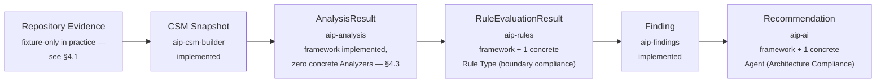

# Explore: What Comes After Architecture Compliance Agent?

Status: exploration only. No proposal, design, spec, or implementation
code is created by this document. Every claim below is grounded in
`openspec/project.md`, `CLAUDE.md`, the 14 archived changes under
`openspec/changes/archive/`, the 8 approved specs under
`openspec/specs/`, and direct inspection of the implemented code
(`aip-core` through `aip-ai`) as of this writing. Facts are stated as
facts, with the file/command that established them; anything not
directly verifiable is marked **Hypothesis**.

## 0. Is `project.md`'s evolution order exhausted?

**Fact.** Yes. `openspec/project.md` §11 names exactly seven steps —
Software Repository Understanding, Canonical Software Model, Analysis
Framework, Rule Framework, Finding Model, Agent Framework, Architecture
Compliance Agent — and every one is specified under `openspec/specs/`.
Six of the seven are implemented, tested, and archived
(`openspec/changes/archive/`); Software Repository Understanding is
specified (33 requirements) but has zero implementation. §11's own
closing sentence is explicit that the list is not meant to extend
itself: *"Additional agents and capabilities should be introduced
through individual specifications and proposals."* No further order is
prescribed anywhere in `project.md`. `define-architecture-compliance-
agent/design.md`'s own Non-Goals says the same thing about its own
scope: *"Deciding what `project.md` capability, if any, comes after
this one — `project.md` §11 names nothing further; out of scope."*

This document does not invent what comes next. It inventories what
`project.md`'s broader sections (§4 Functional Scope, §5 Agent
Architecture, §3.5/§3.7 principles) already name as intended but
not-yet-built, and what the implemented system itself has exposed as
gaps — then asks which of those, if any, is the right next step. Both
kinds of candidate are grounded in existing text or existing code, not
invented.

## 1. What capabilities does AIP have after Architecture Compliance Agent?

**Fact.** The full seven-step pipeline exists as working, tested
*framework* code, plus exactly **one concrete worked example** thread
running end-to-end through the policy-evaluation layers:

315 tests pass across 6 modules (`aip-core`, `aip-csm-builder`,
`aip-analysis`, `aip-rules`, `aip-findings`, `aip-ai`); every module's
own dependency-graph, fixture-scope, and (except `aip-ai`) no-AI-import
CI guards pass under `mvn verify`. Every artifact type has a
deterministic identity; every producing layer has a validate-before-
publish gate; every extension point (Analyzer, Rule Type, Agent) is a
registry that accepts a new implementation with zero change to its own
framework's mechanism, proven concretely by the boundary-compliance
Rule Type and Architecture Compliance Agent themselves.

**Fact, load-bearing for everything below.** Every one of the six
module-to-module boundaries in that diagram has been exercised **only
against hand-built test fixtures**, never against real, non-fixture
content produced by the module immediately upstream. Concretely:

- `aip-csm-builder`'s own `Snapshot` type does not implement
  `aip-core`'s `CsmSnapshotSource` contract (`grep -rn "implements
  CsmSnapshotSource" aip-csm-builder/src/main` returns nothing).
  `scripts/check-no-csm-builder-analysis-adapter.sh` actively forbids
  `aip-csm-builder` from referencing `CsmSnapshotSource`/`CsmScope`/
  `AnalysisResult` at all — this was a deliberate v1 scoping choice
  recorded in `implement-analysis-framework/proposal.md`'s own Binding
  Decision 2, not an oversight.
- `aip-analysis` has **zero concrete `Analyzer` implementations**
  anywhere (`grep -rl "implements Analyzer" aip-analysis/src/main`
  returns nothing) — the framework (`AnalyzerRegistry`,
  `AnalysisOrchestrator`, `AnalysisResultValidator`/`Publisher`/`Store`)
  is fully built and tested, but has never been exercised by a real
  Analyzer.
- Every `implement-*` change from `implement-rule-framework` onward
  states, in its own Binding Decisions, that it builds and tests
  against a fixture implementation of its upstream `*Source` contract,
  explicitly *not* a real adapter to the module that produced it —
  `implement-rule-framework/proposal.md` Binding Decision 2,
  `implement-finding-model/proposal.md` Binding Decision 5,
  `implement-agent-framework/proposal.md` Binding Decision 4 each say
  this in nearly identical language.
- Of the five `*Store` persistence abstractions in this codebase
  (`SnapshotStore`, `AnalysisResultStore`, `RuleEvaluationResultStore`,
  `FindingStore`, `RecommendationStore`), **exactly one** —
  `SnapshotStore`, via `FilesystemSnapshotStore` — has a concrete,
  non-test implementation. The other four are interface-only; nothing
  produced by Analysis Framework, Rule Framework, Finding Model, or
  Agent Framework survives a process restart outside a test.

So: the honest answer to "what capabilities does AIP have" is a fully
specified, fully tested *framework* for the entire pipeline, one
concrete demonstration thread through the policy-evaluation half of
it, and **no path from a real repository to a real, persisted
Recommendation** anywhere in the system today. This is not a defect —
every one of these gaps is a named, deliberate deferral recorded in an
archived `design.md` — but it means "capability" and "runnable against
real data" are not currently the same thing for this codebase.

## 2. What capabilities are explicitly missing based on `project.md` and the approved architecture?

Cross-referencing `project.md` §4 (Functional Scope) and §5 (Agent
Architecture) against what exists. **Fact** for each row unless marked
otherwise.

| `project.md` area | Status |
|---|---|
| §4.1 Repository Discovery, §4.2 Software System Understanding | Specified (`software-repository-understanding`, `canonical-software-model`), zero implementation. No `aip-analyzer` module exists. |
| §4.3 Architecture Analysis | One concrete example (boundary compliance / "must not depend on" only). 6 of 7 named Architecture Agents (§5) unbuilt: Architecture Drift, Dependency Boundary, Layering, Domain Boundary, API Architecture, Event Architecture. "Must only communicate via" explicitly deferred within the one built example. |
| §4.4 Design Analysis | Zero concrete Rule Types or Agents. All 7 named Design Agents (§5) unbuilt: Design Quality, SOLID, Coupling, Cohesion, Complexity, Code Smell, Dependency Cycle. |
| §4.5 Risk Analysis | Zero. All 5 named Risk Agents unbuilt. |
| §4.6 Security Analysis | Zero. All 6 named Security Agents unbuilt. `project.md` itself marks this "should eventually" — the weakest obligation level in the document. |
| §4.7 Compliance Analysis | One concrete example exists (Architecture Compliance is itself filed under both "Architecture" and, per its own Purpose text, a compliance concern), but the 4 named Compliance Agents (Architecture Policy, Coding Standards, Enterprise Policy, Documentation) are unbuilt. |
| §4.8 Findings | Mostly realized — Finding carries ID, Rule ID, Category, Severity, Confidence, Location, Evidence, Description, Impact. `Recommendation`/`Remediation availability` are **permanently** absent from Finding by design (Agent Framework's own Decision 2: a Recommendation is a separate artifact referencing a Finding, never written into it) — a deliberate reinterpretation of §4.8's literal single-record shape, not an unbuilt gap. |
| §4.9 AI Recommendations | Framework built (`aip-ai`), but the one concrete Agent is deterministic and template-based. No LLM/model-provider SDK dependency exists anywhere (`grep -rn "langchain\|openai\|anthropic" */pom.xml` → none); `check-no-ai-heuristic-imports.sh`'s own forbidden-package list exists specifically because no such dependency has ever been added. |
| §4.10 Remediation, §3.5 remediation workflow (`Finding → Recommendation → Proposed Change → Human Approval → Implementation → Tests → Verification`) | Recommendation is the current, deliberate output boundary. Proposed Change, code generation, deployment, remediation verification, and human-approval workflow are **explicitly named out of scope** in `define-agent-framework/design.md` Decision 9 (`Output Boundary Excludes Remediation and Beyond`) and reaffirmed, unchanged, in every later archived design doc through `implement-architecture-compliance-agent`. Nothing here is built or specified. |
| §3.6 Continuous Architecture Governance (CI/CD, PRs, developer workflows) | Nothing built. No `aip-cli`, no `aip-server`. The entire system is reachable only from JUnit tests today. |
| §3.7 Policy as Code | Partially realized in spirit — a `Rule` (identifier, version, `RuleType` reference, config `Map`) is a plain, serializable value. Not realized in practice — the only way to construct and register a `Rule` today is Java code calling `new Rule(...)` and `RuleRegistry.register(...)` directly. No file format, DSL, or data-driven loading mechanism exists; `define-rule-framework/design.md`'s own Decision 1 explicitly rejected building a DSL or adopting an external policy engine as out of scope for that change, without naming when it should be revisited. |

## 3. Which previously deferred items are now candidates for the next evolution?

Every item below is a deferral **named explicitly** in an archived
`design.md`'s own Non-Goals or Risks/Trade-offs section — not
inferred. Grouped by how directly they block the system from running
against real data:

**Blocks the entire pipeline from ever running against real repository content:**
- **Declared/inferred CSM knowledge construction is unassigned.**
  `implement-csm-builder/design.md`'s own Non-Goals names this
  directly: *"Designing any future `declared`- or `inferred`-knowledge-
  producing capability (e.g. a future Architecture Compliance Agent or
  a human-declaration ingestion mechanism) — those remain separate,
  unassigned future capabilities."* CSM Builder is mechanically
  forbidden from constructing `ArchitectureComponentElement` or
  `BOUNDARY_CONSTRAINT` relationships at all
  (`scripts/check-no-excluded-construction.sh`,
  `canonical-software-model`'s `Exclusion of Architectural Inference
  and Declared-Knowledge Construction` requirement). **This means the
  one concrete Rule Type and Agent this project has built — the
  literal Architecture Compliance Agent named in `project.md` §5 as
  the flagship first agent — has no mechanism, anywhere in the
  implemented system, that could ever produce its own required input
  from a real, analyzed repository.** It can only be exercised via
  test fixtures. This is the single most consequential open item this
  exploration found.
- **No `aip-csm-builder` → `aip-analysis` adapter** — deliberately
  guarded against (`check-no-csm-builder-analysis-adapter.sh`), per
  `implement-analysis-framework/proposal.md` Binding Decision 2.
- **No concrete `Analyzer` implementation exists** — `aip-analysis`'s
  own `AnalysisResultSource`-is-"agnostic to production" claim has
  never been tested against real content, only two fixture
  implementations exposing equivalent content.
- **No Software Repository Understanding implementation** (`aip-analyzer`)
  — fully specified (33 requirements), zero code. `implement-csm-
  builder`'s own reserved-but-empty
  `RepositoryToCsmPipelineIntegrationTest` names this directly as the
  future change that would fill it.

**Blocks anything from persisting outside a test process:**
- **Concrete persistence technology for `AnalysisResultStore`,
  `RuleEvaluationResultStore`, `FindingStore`, `RecommendationStore`**
  — each deferred individually, at each layer's own Design stage,
  "the same way `SnapshotStore`'s...was deferred." `SnapshotStore` is
  the only one since resolved (`FilesystemSnapshotStore`).

**Named, scoped-out feature gaps within the one built example:**
- **"Must only communicate via" and other boundary-constraint shapes**
  — `define-architecture-compliance-agent/design.md` Decision 3 defers
  this explicitly, pending CSM vocabulary (or a native-attribute
  convention) rich enough to check it precisely.
- **Recommendation aggregation/deduplication/precedence** — deferred,
  "no concrete driver named" (`define-agent-framework/design.md`
  Decision 5).
- **Broader-context Agent input beyond a bare Finding** —
  `define-agent-framework/design.md` Decision 4 names this as a real
  future possibility, reserved for "a specific future agent" to
  justify concretely, not built speculatively.
- **Finding lifecycle presentation** (a query/dashboard surface
  consuming `LogicalFindingIdentity`/`EvaluationIdentity` to answer
  "is this still a problem?") — Finding Model ships only the
  deterministic ingredients; no consumer exists yet
  (`define-finding-model/design.md` Decision 4).

**Deferred for lack of demonstrated need, not lack of design clarity:**
- **Concurrency infrastructure** — Analysis, Rule, and Agent Framework
  orchestration are each deliberately sequential v1 implementations
  behind a contract that *permits* concurrent/reordered invocation;
  `check-no-concurrency-infrastructure.sh` guards `aip-analysis`
  against introducing it prematurely.
- **A real LLM/model-provider adapter** — named as a Non-Goal in every
  Agent-Framework-adjacent design doc; no provider, model, or
  prompt-engineering approach has been chosen anywhere.

## 4. Are there architectural gaps exposed by the implemented system?

Distinct from "deferred items" (§3) in that these are properties of
the *system as built*, not individually-named future work items —
things that only become visible by looking across all six modules
together rather than reading one `design.md` at a time.

1. **No integration test spans more than one module.** Every
   `*FixtureEndToEndTest` in this codebase is scoped to its own
   module's own fixtures. `aip-rules`'s
   `BoundaryComplianceRuleTypeTest` and `aip-ai`'s
   `ArchitectureComplianceAgentEndToEndTest` together demonstrate the
   *logical* boundary-compliance flow, bridged at the Finding boundary
   by hand-constructing matching fixture content in each — a real,
   named limitation `implement-architecture-compliance-agent/design.md`
   states directly (a true cross-module test "would belong to a future
   `aip-cli`/`aip-server` integration point, not built in this
   change"). **No such integration point exists yet.**
2. **The CI guard system actively prevents the fastest path to closing
   gap #1.** `check-no-csm-builder-analysis-adapter.sh` and the
   `check-no-module-reference.sh` family were each written to enforce
   a specific `implement-*` change's own scoping decision *at the time
   it was made*. They are still active today, unconditionally — none
   of them expire or get revisited once their originating change's
   circumstances change (e.g. once every downstream layer that
   originally justified "no adapter yet" is itself fully built and
   tested). This is not a defect in the guards themselves — each did
   exactly its job — but the *system* has no mechanism for noticing
   when a deferral's original justification has expired.
3. **Every layer's single-repository scope constraint is structural,
   not configurable.** `CsmSnapshotId`, `AnalysisResultId`,
   `RuleEvaluationResultId`, `EvaluationIdentity`, and
   `RecommendationArtifactIdentity` each fold in exactly one
   repository's snapshot identity, inherited layer to layer
   (`define-finding-model/design.md`, `define-agent-framework/design.md`
   each state their own single-repository scope is *inherited*, not a
   fresh decision). No portfolio-level, cross-repository, or
   multi-repository concept exists anywhere in the domain model. Not
   currently a problem — nothing in `project.md` asks for it yet — but
   worth naming as a structural property that would require real
   design work, not a config flag, if ever needed.
4. **`Confidence` (the CSM's own qualitative 3-level enum) is now
   reused for two conceptually different purposes** — CSM's original
   inferred-knowledge Confidence, and Finding's fixed-`HIGH` Confidence
   (`implement-finding-model/design.md` Decision 6). `Recommendation`'s
   own Confidence deliberately did **not** reuse it, choosing a
   continuous `double` instead precisely because Agent-declared
   Confidence needed more precision than 3 discrete levels
   (`implement-agent-framework/design.md` Decision 4). This is
   internally consistent and each choice is individually justified,
   but it means "Confidence" is not one uniform concept across the
   codebase today — a reader has to know which layer's Confidence they
   are looking at.
5. **Policy authoring has no data-driven surface.** Every `Rule` in
   this codebase, including the one that exists
   (`rule.boundary-compliance` in test fixtures), is constructed by
   Java code at a call site, not loaded from any external
   representation. `project.md` §3.7's "policies should be
   version-controlled, testable, and independently maintainable" is
   satisfied at the *type* level (a `Rule` is a plain, comparable
   value) but not at the *authoring* level (there is no way for a
   non-Java-writing user to define one).

## 5. What should the next capability be, and why?

**This is a genuine fork, not something this document resolves.**
Presented as a reasoned recommendation for Design to confirm or
reject, not a decision.

**Recommendation: close the real-data wiring gap before adding any new
Agent, Rule Type, or framework-level capability.** Concretely, in
priority order:

1. Resolve the declared/inferred CSM knowledge question (§3, blocking
   item) — either as its own new capability (as
   `implement-csm-builder/design.md` originally anticipated) or by
   some other mechanism Design identifies. Without this, Architecture
   Compliance Agent — the one capability `project.md` treats as
   this project's flagship first agent — cannot run against a real
   repository, ever, regardless of what else gets built.
2. Build a real `aip-csm-builder` → `aip-analysis` adapter (retiring
   or narrowing `check-no-csm-builder-analysis-adapter.sh`'s current
   unconditional prohibition) and at least one concrete `Analyzer`, so
   `AnalysisResultSource`'s "agnostic to production" claim is actually
   exercised.
3. Choose and build concrete persistence technology for the four
   still-interface-only `*Store`s.

**Why this over a new Agent or a new pipeline stage:** every
`project.md`-named capability from here forward (any §5 agent, Proposed
Change, remediation) produces more of the same kind of artifact this
system already knows how to produce — the framework mechanism is not
the bottleneck. What's missing is the ability to run *any* of it
against something other than a fixture. Adding a seventh Agent before
fixing this would extend the same "fully tested, never run for real"
property to more surface area rather than resolving it. This mirrors
`project.md` §3.2's own Deterministic-Before-AI principle read at the
system level: prove the deterministic foundation actually works end to
end before investing further in the AI-reasoning layer built on top of
it.

**Confidence: moderate, not high.** The counter-argument (§6, next)
is real and this document does not attempt to settle it.

## 6. What alternative next capabilities should we consider?

Each grounded in something already named in `project.md` or an
existing deferral, not invented:

- **A second concrete Rule Type/Agent that does *not* require
  declared/inferred CSM knowledge.** The Dependency Boundary Agent or
  a Dependency Cycle Rule Type (both named in `project.md` §5) could
  plausibly be built entirely against `DEPENDENCY`/`CONTAINMENT`
  relationships CSM Builder *already* constructs from real evidence —
  sidestepping the Architecture Component/Boundary blocker (§3, §5)
  entirely while still adding real, usable capability. Worth Design
  confirming whether this is actually true before assuming it.
- **A concrete `Analyzer`** (e.g. dependency-cycle detection or a
  coupling metric, both explicitly named in `project.md` §4.4/§4.5) —
  gives Analysis Framework its first real exercise and unblocks any
  future Rule Type that *does* declare Analyzer inputs (unlike
  boundary compliance, which declares none).
- **Software Repository Understanding's real implementation**
  (`aip-analyzer`) — already fully specified, zero code; the most
  "shovel-ready" capability in the sense that no Design work is needed
  before Implementation could begin. Does not, by itself, unblock
  Architecture Compliance Agent (declared/inferred knowledge is a
  separate gap), but does unblock everything upstream of Architecture
  Components.
- **A policy-as-code authoring capability** — a file format or DSL a
  `Rule` can be loaded from, addressing the §4 gap named above.
  `define-rule-framework/design.md` Decision 1 explicitly left this
  question open for later rather than closing it permanently.
- **Persistence technology for the four open `*Store` interfaces** —
  narrow, well-bounded, low architectural risk, but arguably necessary
  regardless of which other candidate is chosen.
- **`aip-cli` / `aip-server`** — named in `CLAUDE.md`'s own module
  chain since before any framework existed; would give the system its
  first real integration point and directly address the "no test
  spans more than one module" gap (§4.1). Genuinely large scope with
  no design work started at all.
- **Proposed Change** — the literal next stage in `project.md` §3.5's
  own remediation pipeline. See §7 for why this document recommends
  against building it now.

## 7. Which candidate should NOT be built yet, and why?

- **Proposed Change / remediation execution.** Repeatedly, explicitly
  named out of scope across five archived design documents
  (`define-agent-framework` through `implement-architecture-compliance-
  agent`), each reaffirming the same boundary without revisiting it.
  Building it now would also mean designing its shape before any
  real-data Recommendation has ever been produced to learn from —
  `project.md` §7's own Non-Goal ("treat AI-generated recommendations
  as unquestionable truth") argues for restraint here specifically.
- **Any further §5 Agent beyond a second, carefully-chosen Architecture
  Agent** (per §6's caveat about avoiding the declared/inferred CSM
  blocker). Multiplying Agents before the pipeline runs against real
  data multiplies the same limitation (§4.1) rather than resolving it.
- **A real LLM/model-provider adapter.** Reasonable eventually, but
  wiring a real model against Findings that only ever originate from
  fixtures would produce a validation signal that looks meaningful but
  isn't — there is no real Finding content yet to meaningfully reason
  about. Should follow, not precede, resolving the real-data wiring
  gap.
- **Concurrency infrastructure.** No evidence of an actual performance
  or scale problem exists yet — `project.md` §8's Performance/
  Scalability quality attributes are aspirational ("should eventually
  support"), not yet pressured by any real usage. Every prior layer
  already deferred this for the same reason; nothing has changed.
- **A cross-repository/portfolio-level capability** (§4.3). Nothing in
  `project.md` currently asks for this, and it would require
  reconsidering an identity scheme threaded through every layer, not
  a local change.

## 8. Does the next capability require a new module, a new `aip-core` contract, or neither?

Genuinely conditional on which candidate is chosen — no single answer.

| Candidate | Module | `aip-core` contract | Notes |
|---|---|---|---|
| Declared/inferred CSM knowledge (Architecture Component/Boundary construction) | **Undecided** — `implement-csm-builder/design.md` left this "unassigned"; could be a new module or a new subpackage/mode within an existing one | Neither — `ArchitectureComponentElement` and `BOUNDARY_CONSTRAINT` already exist in `aip-core` | The genuinely open question here is *how* declared/inferred knowledge gets asserted (a config file? a separate ingestion pipeline? human declaration?), not the CSM shape it targets |
| Real `aip-csm-builder`→`aip-analysis` adapter | Neither | Neither — `CsmSnapshotSource` already exists; `Snapshot` implementing it requires no new Maven dependency, only relaxing `check-no-csm-builder-analysis-adapter.sh` | The blocker is a CI guard's current unconditional scope, not a missing type |
| A concrete `Analyzer` | Neither — lives inside `aip-analysis` | Neither | Mirrors the boundary-compliance/Architecture-Compliance-Agent precedent exactly: a new subpackage inside an already-existing module |
| A concrete Rule Type/Agent (e.g. Dependency Boundary) | Neither | Neither | Same precedent |
| Software Repository Understanding implementation | **New module** (`aip-analyzer`, already named in `CLAUDE.md`'s module graph) | Possibly — depends on whether Repository Evidence needs anything beyond `aip.core.evidence`'s existing contract; genuinely undesigned | Fully specified upstream; Design work here is mostly implementation-shape, not conceptual |
| Persistence technology for the four open `*Store`s | Neither, most likely | Neither | Concrete implementation inside each store's own owning module, mirroring `FilesystemSnapshotStore`'s own placement in `aip-csm-builder` |
| Policy-as-code authoring | **Open** — could fold into `aip-rules` or motivate a new module (a config-loading library) | Unlikely | Genuinely undesigned |
| `aip-cli` / `aip-server` | **New module(s)**, already named in `CLAUDE.md`'s intended chain | Likely — an integration surface probably needs read access to every `*Store`/`*Source` | Large, undesigned scope |
| Proposed Change (not recommended yet, §7) | Very likely a new module | Very likely a new contract, mirroring the `FindingSource`/`RecommendationStore` precedent | Explicitly out of scope currently |

## 9. Does the current dependency graph need to evolve?

**Fact, for the highest-priority candidate (§5):** no new module and
no new `aip-core` contract are required to close the real-data wiring
gap — every type needed (`CsmSnapshotSource`) already exists, and
`aip-csm-builder` already depends on `aip-core`, where it lives. The
six-independent-siblings-around-`aip-core` shape (`docs/architecture.md`
§2) already structurally supports this. **What does need to change is
a CI guard's scope** — `check-no-csm-builder-analysis-adapter.sh`
currently forbids the exact reference a real adapter would require,
unconditionally. This is a decision to surface explicitly to Design,
not a silent relaxation to make here.

**For other candidates**, the graph would evolve in already-anticipated
ways: `aip-analyzer` (Software Repository Understanding) has been a
named sibling in `CLAUDE.md`'s module chain since before any framework
existed; `aip-cli`/`aip-server` are named the same way, as future
consumers of the existing modules, never producers other modules would
depend on.

**No candidate examined here requires changing the "siblings depend on
`aip-core` only, never on each other" invariant itself** — every real
integration point identified (CSM Builder→Analysis, a future
CLI/server) either already has, or would naturally use, an `aip-core`
contract rather than a direct module dependency, consistent with every
layer built so far.

## 10. Are there any existing design decisions that should be reconsidered before extending the platform?

Four candidates, each because the circumstance that originally
justified the decision has since changed (every downstream layer now
exists and is tested) — none of these should be silently reopened;
each belongs in a future Design phase for the specific change that
would touch it:

1. **`check-no-csm-builder-analysis-adapter.sh`'s unconditional "no
   adapter" stance.** Written when `aip-analysis` did not exist yet
   (`implement-analysis-framework/proposal.md` Binding Decision 2
   reasoned from "no concrete implementation of `aip-analysis` exists
   yet"). It now does, fully. Whether to relax this guard — and
   exactly what a real adapter's contract should guarantee — is a
   genuine question for whichever future change tackles §5's top
   recommendation.
2. **CSM Builder's "declared/inferred knowledge is someone else's
   problem" deferral.** Reasonable when nothing downstream existed to
   consume Architecture Component/Boundary content; now that
   Architecture Compliance Agent is built and fully depends on exactly
   that content, the deferral's cost (an unusable-against-real-data
   flagship agent) is concrete rather than hypothetical. Whether this
   belongs inside CSM Builder itself (reopening its own "observed-only"
   scoping) or as a wholly separate capability is a genuine fork this
   document does not resolve.
3. **`RecommendationStore`'s deliberate non-promotion to `aip-core`**
   (`define-agent-framework/design.md` Decision 8: "no capability...
   is yet known to need to read Recommendations"). Still true today —
   no second consumer is named anywhere. Not yet ripe to revisit, but
   would become so the moment any candidate in §6/§8 (a CLI, a
   dashboard, Proposed Change) is actually chosen.
4. **Whether "no aggregation, ever" (Finding Model) and "no conflict/
   precedence, ever" (Agent Framework) remain right** once real,
   non-fixture Finding/Recommendation volume exists. Both were
   deferred explicitly for "no concrete driver named yet, not lack of
   design clarity" — the same reasoning that makes them *not* ripe to
   revisit until real volume exists, which itself depends on §5's
   recommendation being acted on first.

## Summary

**What we found:** `project.md`'s named evolution order is fully
exhausted — every step through Architecture Compliance Agent is
specified, and six of seven are implemented and tested. But the
implemented system, examined as a whole rather than one archived
`design.md` at a time, reveals that **every module boundary has only
ever been exercised against fixtures**, and the one concrete
capability this project has built — Architecture Compliance Agent —
currently has no path to run against a real, analyzed repository at
all, because nothing in the system can construct its required
Architecture Component/Boundary input from real evidence.

**What we recommend:** treat "make the already-built pipeline run
against real data" as at least as urgent as "build the next named
capability from `project.md` §5" — with a specific, evidence-grounded
priority order (§5) — while naming a real alternative (§6) and a real
counter-consideration (§5's own "moderate, not high" confidence) rather
than presenting this as settled.

**What should go to a future Design phase**, not resolved here:

- Whether declared/inferred CSM knowledge construction becomes a new
  capability, folds into CSM Builder, or takes some third shape not
  considered here (§3, §10.2).
- Whether `check-no-csm-builder-analysis-adapter.sh` should be relaxed,
  replaced, or redefined, and what a real `aip-csm-builder`→
  `aip-analysis` adapter should actually guarantee (§9, §10.1).
- Whether a second concrete Rule Type/Agent that avoids the
  declared/inferred blocker (e.g. Dependency Boundary) is actually
  buildable against real CSM content today, as §6 hypothesizes but
  does not verify.
- Which of the four still-open `*Store` interfaces should get concrete
  persistence technology first, and whether one technology choice
  should span all four or each should choose independently.
- Whether Software Repository Understanding's real implementation
  should be sequenced before or after the wiring-gap work this
  document recommends prioritizing.

This document takes no position on which of these forks resolves which
way — each requires evidence or a decision this exploration alone
cannot produce.
